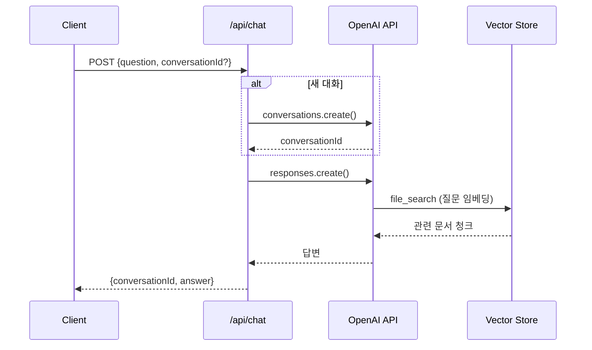

# PRD: Tax-Free - AI 세금 상담 챗봇 (백엔드)

## 1. 개요

### 1.1 프로젝트 명
**Tax-Free** - RAG 기반 세금 정보 제공 챗봇 백엔드

### 1.2 목적
OpenAI Responses API와 Vector Store를 활용하여 세법 PDF 문서 기반의 정확한 세금 정보를 제공하는 챗봇 API 구축

### 1.3 핵심 가치
- 공식 세법 문서 기반의 신뢰할 수 있는 정보
- RAG를 통한 컨텍스트 기반 답변
- 멀티턴 대화 지원으로 자연스러운 상담 경험

### 1.4 개발 범위 (v1.0)
- **포함**: 
  - POST /api/chat 엔드포인트 구현
  - OpenAI Responses API 연동
  - Vector Store 설정 및 관리
  - 세무 지식 데이터 타입 정의
  
- **제외**: 
  - 프론트엔드 구현 (다른 팀원 담당)
  - 사용자 인증/로그인
  - DB 연동
  - 관리자 페이지

---

## 2. 기술 스택

### 2.1 백엔드
- **Framework**: Next.js 14+ (App Router)
- **Language**: TypeScript
- **API Runtime**: Next.js API Routes (서버리스)

### 2.2 AI & RAG
- **LLM API**: OpenAI Responses API
- **Model**: gpt-4o
- **RAG**: OpenAI Vector Store + File Search
- **Embeddings**: OpenAI Embeddings (자동)

### 2.3 데이터 저장
- **세션 관리**: 브라우저 세션 (서버 상태 없음)
- **대화 이력**: OpenAI Conversations API (서버 측)
- **DB**: 없음 (세션 스토리지만 사용)

### 2.4 배포
- **호스팅**: Vercel
- **환경변수**: Vercel Environment Variables

---

## 3. 시스템 아키텍처

### 3.1 전체 구조

```
클라이언트 (브라우저)
    ↓ [conversationId 포함]
    ↓
POST /api/chat
    ↓
[Responses API 호출]
    ↓
OpenAI Responses API
    ↓ [file_search tool]
    ↓
Vector Store (세금 PDF 5개)
    ↓
[답변 생성]
    ↓
클라이언트 (JSON 응답)
```

### 3.2 데이터 흐름



---

## 4. 프로젝트 구조

```
tax-free/
├── app/
│   ├── page.tsx                    # 메인 페이지 (프론트엔드 담당)
│   ├── api/
│   │   └── chat/
│   │       └── route.ts            # ✅ AI 챗봇 API (백엔드 구현)
│   ├── components/                 # 프론트엔드 담당
│   │   ├── ChatWindow.tsx
│   │   ├── ChatInput.tsx
│   │   └── Header.tsx
│   └── data/
│       └── tax-knowledge.ts        # ✅ 타입 정의 (백엔드 구현)
├── lib/
│   ├── openai.ts                   # ✅ OpenAI 클라이언트 설정
│   ├── types.ts                    # ✅ 공통 타입 정의
│   └── validation.ts               # ✅ 요청 검증 스키마
├── scripts/
│   ├── setup-vector-store.ts       # ✅ Vector Store 초기 설정
│   └── upload-pdfs.ts              # ✅ PDF 업로드 스크립트
├── public/
│   └── tax-pdfs/                   # ✅ 세금 PDF 파일 (5개)
│       ├── 소득세법.pdf
│       ├── 부가가치세법.pdf
│       ├── 법인세법.pdf
│       ├── 종합부동산세법.pdf
│       └── 세금신고가이드.pdf
├── .env.local                      # ✅ 환경변수
├── package.json
└── tsconfig.json
```

### 백엔드 담당 파일 (✅)
1. `app/api/chat/route.ts` - 메인 API 엔드포인트
2. `app/data/tax-knowledge.ts` - 타입 정의
3. `lib/openai.ts` - OpenAI 설정
4. `lib/types.ts` - 공통 타입
5. `lib/validation.ts` - 검증 로직
6. `scripts/*` - 초기 설정 스크립트
7. `public/tax-pdfs/*` - PDF 파일 준비

---

## 5. API 명세

### 5.1 POST /api/chat

채팅 질문을 받아 AI 답변을 반환하는 메인 엔드포인트

#### 5.1.1 Request

```typescript
POST /api/chat
Content-Type: application/json

{
  "conversationId": "conv_abc123...",  // 선택 (없으면 새 대화 생성)
  "question": "종합소득세 신고 기한은 언제인가요?"
}
```

**필드 설명**:
- `conversationId` (string, optional): OpenAI Conversation ID. 없으면 새 대화 생성
- `question` (string, required): 사용자 질문 (1~1000자)

#### 5.1.2 Response (성공 - 200 OK)

```typescript
{
  "conversationId": "conv_abc123...",
  "answer": "종합소득세 신고 기한은 매년 5월 1일부터 5월 31일까지입니다. 근로소득만 있는 경우 회사에서 연말정산을 하므로 별도 신고가 필요 없지만, 사업소득이나 기타소득이 있는 경우 반드시 신고해야 합니다.",
  "timestamp": "2024-02-07T10:30:00Z"
}
```

**필드 설명**:
- `conversationId`: 대화 ID (클라이언트가 다음 요청 시 전달)
- `answer`: AI 생성 답변
- `timestamp`: 응답 생성 시각 (ISO 8601)

#### 5.1.3 Response (에러)

```typescript
// 400 Bad Request - 잘못된 요청
{
  "error": "INVALID_REQUEST",
  "message": "질문은 1~1000자여야 합니다",
  "details": [
    {
      "field": "question",
      "issue": "String must contain at most 1000 character(s)"
    }
  ]
}

// 404 Not Found - 존재하지 않는 대화
{
  "error": "CONVERSATION_NOT_FOUND",
  "message": "존재하지 않는 대화입니다"
}

// 429 Too Many Requests - 속도 제한 (v1 미구현, 문서만 유지)
{
  "error": "RATE_LIMIT_EXCEEDED",
  "message": "요청이 너무 많습니다. 잠시 후 다시 시도해주세요",
  "retryAfter": 60  // 초 단위
}

// 500 Internal Server Error
{
  "error": "INTERNAL_ERROR",
  "message": "서버 오류가 발생했습니다"
}

// 502 Bad Gateway - OpenAI API 오류
{
  "error": "OPENAI_API_ERROR",
  "message": "AI 서비스 오류입니다. 잠시 후 다시 시도해주세요"
}
```

#### 5.1.4 에러 코드 정의

| 코드 | HTTP 상태 | 설명 | 재시도 가능 |
|------|-----------|------|------------|
| INVALID_REQUEST | 400 | 요청 형식 오류 | ❌ |
| CONVERSATION_NOT_FOUND | 404 | 대화 ID 없음 | ❌ |
| RATE_LIMIT_EXCEEDED | 429 | 속도 제한 (v1 미구현) | ✅ (60초 후) |
| OPENAI_API_ERROR | 502 | OpenAI 오류 | ✅ (즉시) |
| INTERNAL_ERROR | 500 | 서버 오류 | ✅ (즉시) |

---

## 6. 데이터 모델

### 6.1 환경변수

```env
# .env.local
OPENAI_API_KEY=sk-...
PROMPT_ID=prompt_...              # 대시보드에서 생성
VECTOR_STORE_ID=vs_...            # setup 스크립트에서 생성

```

### 6.2 TypeScript 타입 정의

```typescript
// lib/types.ts

/**
 * API 요청/응답 타입
 */
export interface ChatRequest {
  conversationId?: string;
  question: string;
}

export interface ChatResponse {
  conversationId: string;
  answer: string;
  timestamp: string;
}

/**
 * 에러 응답 타입
 */
export interface ErrorResponse {
  error: ErrorCode;
  message: string;
  details?: any;
  retryAfter?: number;
}

export type ErrorCode =
  | 'INVALID_REQUEST'
  | 'CONVERSATION_NOT_FOUND'
  | 'RATE_LIMIT_EXCEEDED'
  | 'OPENAI_API_ERROR'
  | 'INTERNAL_ERROR';

/**
 * OpenAI API 응답 타입
 */
export interface OpenAIResponse {
  id: string;
  object: 'response';
  output: ResponseOutput[];
  // ... 기타 필드
}

export interface ResponseOutput {
  type: 'message';
  content: ContentBlock[];
}

export interface ContentBlock {
  type: 'text';
  text: string;
  annotations?: Annotation[];
}

export interface Annotation {
  type: 'file_citation';
  file_citation: {
    file_id: string;
    quote: string;
  };
}
```

### 6.3 세무 지식 데이터 타입

```typescript
// app/data/tax-knowledge.ts

/**
 * 세금 관련 상수 및 메타데이터
 */
export const TAX_CATEGORIES = {
  INCOME: '종합소득세',
  VAT: '부가가치세',
  CORPORATE: '법인세',
  PROPERTY: '종합부동산세',
  GENERAL: '일반 세무'
} as const;

export type TaxCategory = typeof TAX_CATEGORIES[keyof typeof TAX_CATEGORIES];

/**
 * PDF 파일 메타데이터
 */
export interface TaxDocument {
  fileName: string;
  category: TaxCategory;
  description: string;
  lastUpdated: string;
}

export const TAX_DOCUMENTS: TaxDocument[] = [
  {
    fileName: '소득세법.pdf',
    category: TAX_CATEGORIES.INCOME,
    description: '종합소득세 관련 법령',
    lastUpdated: '2024-01-01'
  },
  {
    fileName: '부가가치세법.pdf',
    category: TAX_CATEGORIES.VAT,
    description: '부가가치세 관련 법령',
    lastUpdated: '2024-01-01'
  },
  {
    fileName: '법인세법.pdf',
    category: TAX_CATEGORIES.CORPORATE,
    description: '법인세 관련 법령',
    lastUpdated: '2024-01-01'
  },
  {
    fileName: '종합부동산세법.pdf',
    category: TAX_CATEGORIES.PROPERTY,
    description: '종합부동산세 관련 법령',
    lastUpdated: '2024-01-01'
  },
  {
    fileName: '세금신고가이드.pdf',
    category: TAX_CATEGORIES.GENERAL,
    description: '세금 신고 실무 가이드',
    lastUpdated: '2024-01-01'
  }
];

/**
 * 예시 질문 (프론트엔드 참고용)
 */
export const EXAMPLE_QUESTIONS = [
  "종합소득세 신고 기한은 언제인가요?",
  "부가가치세 계산 방법을 알려주세요",
  "프리랜서 세금 신고는 어떻게 하나요?",
  "법인세 신고 대상은 누구인가요?",
  "종합부동산세는 언제 부과되나요?"
];
```

---

## 7. 핵심 구현

### 7.1 OpenAI 클라이언트 설정

```typescript
// lib/openai.ts
import OpenAI from 'openai';

// 환경변수 검증
if (!process.env.OPENAI_API_KEY) {
  throw new Error('OPENAI_API_KEY is required');
}

if (!process.env.PROMPT_ID) {
  throw new Error('PROMPT_ID is required');
}

if (!process.env.VECTOR_STORE_ID) {
  throw new Error('VECTOR_STORE_ID is required');
}

export const openai = new OpenAI({
  apiKey: process.env.OPENAI_API_KEY,
});

export const CONFIG = {
  PROMPT_ID: process.env.PROMPT_ID,
  VECTOR_STORE_ID: process.env.VECTOR_STORE_ID,
  MODEL: 'gpt-4o',
  MAX_TOKENS: 2000,
  TEMPERATURE: 0.3,  // 낮은 온도로 일관된 답변
} as const;
```

### 7.2 요청 검증

```typescript
// lib/validation.ts
import { z } from 'zod';

export const ChatRequestSchema = z.object({
  conversationId: z.string().optional(),
  question: z.string()
    .min(1, '질문을 입력해주세요')
    .max(1000, '질문은 1000자를 초과할 수 없습니다')
    .trim()
});

export type ValidatedChatRequest = z.infer<typeof ChatRequestSchema>;

export function validateRequest(data: unknown): ValidatedChatRequest {
  return ChatRequestSchema.parse(data);
}
```

### 7.3 메인 API Route

```typescript
// app/api/chat/route.ts
import { NextRequest, NextResponse } from 'next/server';
import { openai, CONFIG } from '@/lib/openai';
import { validateRequest } from '@/lib/validation';
import type { ChatResponse, ErrorResponse } from '@/lib/types';

export const runtime = 'edge'; // Edge Runtime 사용 (빠른 응답)

export async function POST(request: NextRequest) {
  try {
    // 1. 요청 파싱 및 검증
    const body = await request.json();
    const { conversationId, question } = validateRequest(body);
    
    // 2. Conversation ID 처리
    let activeConversationId = conversationId;
    
    if (!activeConversationId) {
      // 새 대화 생성
      const conversation = await openai.beta.conversations.create({
        metadata: {
          created_at: new Date().toISOString(),
          source: 'tax-free-web'
        }
      });
      activeConversationId = conversation.id;
    } else {
      // 기존 대화 존재 확인
      try {
        await openai.beta.conversations.retrieve(activeConversationId);
      } catch (error: any) {
        if (error?.status === 404) {
          return NextResponse.json<ErrorResponse>(
            {
              error: 'CONVERSATION_NOT_FOUND',
              message: '존재하지 않는 대화입니다'
            },
            { status: 404 }
          );
        }
        throw error;
      }
    }
    
    // 3. Responses API 호출
    const response = await openai.responses.create({
      model: CONFIG.MODEL,
      prompt: CONFIG.PROMPT_ID,
      conversation: activeConversationId,
      input: [
        {
          type: 'message',
          role: 'user',
          content: question
        }
      ],
      tool_resources: {
        file_search: {
          vector_store_ids: [CONFIG.VECTOR_STORE_ID]
        }
      },
      max_output_tokens: CONFIG.MAX_TOKENS,
      temperature: CONFIG.TEMPERATURE
    });
    
    // 4. 응답 파싱
    const output = response.output[0];
    
    if (output.type !== 'message') {
      throw new Error('Unexpected output type');
    }
    
    const contentBlock = output.content[0];
    
    if (contentBlock.type !== 'text') {
      throw new Error('Unexpected content type');
    }
    
    const answer = contentBlock.text;
    
    // 5. 응답 반환
    const responseData: ChatResponse = {
      conversationId: activeConversationId,
      answer,
      timestamp: new Date().toISOString()
    };
    
    return NextResponse.json(responseData, {
      status: 200,
      headers: {
        'Cache-Control': 'no-store, no-cache, must-revalidate',
      }
    });
    
  } catch (error: any) {
    console.error('Chat API error:', error);
    
    // Zod 검증 에러
    if (error.name === 'ZodError') {
      return NextResponse.json<ErrorResponse>(
        {
          error: 'INVALID_REQUEST',
          message: '잘못된 요청입니다',
          details: error.errors
        },
        { status: 400 }
      );
    }
    
    // OpenAI API 에러 (모두 502로 처리)
    if (error?.status) {
      return NextResponse.json<ErrorResponse>(
        {
          error: 'OPENAI_API_ERROR',
          message: 'AI 서비스 오류입니다. 잠시 후 다시 시도해주세요'
        },
        { status: 502 }
      );
    }
    
    // 일반 에러
    return NextResponse.json<ErrorResponse>(
      {
        error: 'INTERNAL_ERROR',
        message: '서버 오류가 발생했습니다'
      },
      { status: 500 }
    );
  }
}

// CORS 헤더 (필요시)
export async function OPTIONS() {
  return new NextResponse(null, {
    status: 200,
    headers: {
      'Access-Control-Allow-Origin': '*',
      'Access-Control-Allow-Methods': 'POST, OPTIONS',
      'Access-Control-Allow-Headers': 'Content-Type'
    }
  });
}
```

---

## 8. 초기 설정 스크립트

### 8.1 Vector Store 설정

```typescript
// scripts/setup-vector-store.ts
import OpenAI from 'openai';
import * as fs from 'fs';
import * as path from 'path';
import * as dotenv from 'dotenv';

dotenv.config({ path: '.env.local' });

const openai = new OpenAI({
  apiKey: process.env.OPENAI_API_KEY!
});

async function main() {
  console.log('🚀 Tax-Free Vector Store 설정 시작\n');
  
  // 1. Vector Store 생성
  console.log('1️⃣ Vector Store 생성 중...');
  const vectorStore = await openai.beta.vectorStores.create({
    name: 'Tax-Free Knowledge Base',
    metadata: {
      project: 'tax-free',
      version: '1.0',
      created_at: new Date().toISOString()
    }
  });
  
  console.log(`✅ Vector Store 생성 완료: ${vectorStore.id}\n`);
  
  // 2. PDF 파일 목록
  const pdfDir = path.join(process.cwd(), 'public/tax-pdfs');
  const pdfFiles = [
    '소득세법.pdf',
    '부가가치세법.pdf',
    '법인세법.pdf',
    '종합부동산세법.pdf',
    '세금신고가이드.pdf'
  ];
  
  console.log(`2️⃣ ${pdfFiles.length}개 PDF 파일 업로드 중...\n`);
  
  const fileIds: string[] = [];
  
  for (const fileName of pdfFiles) {
    const filePath = path.join(pdfDir, fileName);
    
    // 파일 존재 확인
    if (!fs.existsSync(filePath)) {
      console.error(`❌ 파일을 찾을 수 없습니다: ${fileName}`);
      continue;
    }
    
    console.log(`   📄 업로드 중: ${fileName}...`);
    
    const fileStream = fs.createReadStream(filePath);
    
    const file = await openai.files.create({
      file: fileStream,
      purpose: 'assistants'
    });
    
    fileIds.push(file.id);
    console.log(`   ✓ 완료 (ID: ${file.id})`);
  }
  
  console.log(`\n✅ ${fileIds.length}개 파일 업로드 완료\n`);
  
  // 3. Vector Store에 파일 연결
  console.log('3️⃣ Vector Store에 파일 추가 중...\n');
  
  for (let i = 0; i < fileIds.length; i++) {
    await openai.beta.vectorStores.files.create(
      vectorStore.id,
      { file_id: fileIds[i] }
    );
    console.log(`   ✓ 파일 ${i + 1}/${fileIds.length} 추가 완료`);
  }
  
  // 4. 벡터화 완료 대기
  console.log('\n4️⃣ 벡터화 진행 중...\n');
  
  let status = 'in_progress';
  let previousCompleted = 0;
  
  while (status === 'in_progress') {
    await new Promise(resolve => setTimeout(resolve, 3000));
    
    const vs = await openai.beta.vectorStores.retrieve(vectorStore.id);
    status = vs.status;
    
    const completed = vs.file_counts.completed;
    const total = vs.file_counts.total;
    
    if (completed > previousCompleted) {
      console.log(`   진행률: ${completed}/${total} 파일 처리 완료`);
      previousCompleted = completed;
    }
  }
  
  // 5. 최종 확인
  const finalVS = await openai.beta.vectorStores.retrieve(vectorStore.id);
  
  console.log('\n🎉 설정 완료!\n');
  console.log('━━━━━━━━━━━━━━━━━━━━━━━━━━━━━━━━━━━━');
  console.log('다음 내용을 .env.local 파일에 추가하세요:\n');
  console.log(`VECTOR_STORE_ID=${vectorStore.id}`);
  console.log('━━━━━━━━━━━━━━━━━━━━━━━━━━━━━━━━━━━━\n');
  console.log(`상태: ${finalVS.status}`);
  console.log(`총 파일: ${finalVS.file_counts.total}개`);
  console.log(`처리 완료: ${finalVS.file_counts.completed}개`);
  console.log(`실패: ${finalVS.file_counts.failed}개`);
}

main().catch(console.error);
```

**실행 방법**:
```bash
# 1. PDF 파일을 public/tax-pdfs/ 에 배치
mkdir -p public/tax-pdfs
# 5개 PDF 파일 복사

# 2. 스크립트 실행
npx tsx scripts/setup-vector-store.ts

# 3. 출력된 VECTOR_STORE_ID를 .env.local에 추가
```

### 8.2 Prompt 설정 (대시보드)

**위치**: https://platform.openai.com/playground

**설정 내용**:
```
Name: Tax-Free Assistant v1

Instructions:
당신은 대한민국 세법 전문 상담 AI입니다.

핵심 원칙:
1. 제공된 세법 문서만을 기반으로 답변하세요
2. 문서에 없는 내용은 "제공된 자료에서 해당 정보를 찾을 수 없습니다"라고 명확히 밝히세요
3. 법령 근거를 반드시 함께 제시하세요
4. 복잡한 내용은 구체적인 예시로 쉽게 설명하세요
5. 전문 용어는 풀어서 설명하세요

답변 형식:
- 핵심 답변 (2-3문장)
- 법적 근거 (조항 명시)
- 필요시 구체적 예시
- 3-5문장 이내로 간결하게

주의사항:
- 개인 맞춤형 세무 조언은 하지 마세요
- 불확실한 내용은 "세무사 상담을 권장합니다"라고 안내하세요
- 최신 세법 변경사항은 제공된 문서 기준입니다

Model: gpt-4o

Temperature: 0.3

Tools: ✅ file_search
  - Max results: 20
  - Ranking options: auto
```

**저장 후**: Prompt ID 복사 → `.env.local`에 추가

---

## 9. 개발 워크플로우

### 9.1 개발 환경 설정

```bash
# 1. 저장소 클론
git clone <repository-url>
cd tax-free

# 2. 의존성 설치
npm install

# 3. 환경변수 설정
cp .env.example .env.local
# OPENAI_API_KEY, PROMPT_ID 입력

# 4. Vector Store 설정
npm run setup:vector-store

# 5. 개발 서버 실행
npm run dev
```

### 9.2 package.json scripts

```json
{
  "scripts": {
    "dev": "next dev",
    "build": "next build",
    "start": "next start",
    "lint": "next lint",
    "setup:vector-store": "tsx scripts/setup-vector-store.ts",
    "test": "vitest",
    "test:api": "vitest run --config vitest.config.api.ts"
  }
}
```

### 9.3 API 테스트

```bash
# cURL 테스트
curl -X POST http://localhost:3000/api/chat \
  -H "Content-Type: application/json" \
  -d '{
    "question": "종합소득세 신고 기한은?"
  }'

# 후속 질문 테스트
curl -X POST http://localhost:3000/api/chat \
  -H "Content-Type: application/json" \
  -d '{
    "conversationId": "conv_abc123...",
    "question": "신고 안 하면 어떻게 되나요?"
  }'
```

---

## 10. 성능 요구사항

### 10.1 응답 시간
- **P95**: 5초 이내
- **P99**: 10초 이내
- **타임아웃**: 30초

### 10.2 처리량
- **동시 사용자**: 100명
- **일일 질문**: 1,000개
- **분당 요청**: ~17 RPM (여유 있게 처리 가능)

### 10.3 최적화 전략
```typescript
// Edge Runtime 사용
export const runtime = 'edge';

// 낮은 Temperature로 일관성 확보
temperature: 0.3

// 적절한 max_tokens 설정
max_output_tokens: 2000
```

---

## 11. 비용 추정

### 11.1 OpenAI API 비용

```
가정:
- 일일 질문: 1,000개
- 월 총 질문: 30,000개

비용 계산:
1. 입력 토큰 (평균 500 토큰/질문)
   - 30,000 × 500 = 15M 토큰
   - $2.50/1M × 15 = $37.50

2. 출력 토큰 (평균 300 토큰/답변)
   - 30,000 × 300 = 9M 토큰
   - $10/1M × 9 = $90.00

3. File Search
   - $0.03/요청 × 30,000 = $900

4. Vector Store
   - $0.10/GB/day × 1GB × 30일 = $3

월 총 비용: ~$1,030
```

### 11.2 Vercel 비용
- **Hobby (무료)**: 100GB 대역폭, 100GB-시간 Edge Functions
- **예상 사용량**: 무료 범위 내

### 11.3 비용 최적화
```typescript
// 1. 캐싱 (향후 구현)
// - 동일 질문 Redis 캐싱
// - 예상 절감: 20-30%

// 2. Temperature 낮춤으로 출력 토큰 감소
temperature: 0.3  // 일관되고 짧은 답변

// 3. max_tokens 제한
max_output_tokens: 2000  // 불필요하게 긴 답변 방지
```

---

## 12. 테스트 계획

### 12.1 단위 테스트

```typescript
// __tests__/lib/validation.test.ts
import { describe, it, expect } from 'vitest';
import { validateRequest } from '@/lib/validation';

describe('validateRequest', () => {
  it('유효한 요청을 통과시킴', () => {
    const result = validateRequest({
      question: '종합소득세란?'
    });
    
    expect(result.question).toBe('종합소득세란?');
  });
  
  it('빈 질문을 거부함', () => {
    expect(() => {
      validateRequest({ question: '' });
    }).toThrow('질문을 입력해주세요');
  });
  
  it('1000자 초과 질문을 거부함', () => {
    expect(() => {
      validateRequest({ question: 'a'.repeat(1001) });
    }).toThrow('1000자를 초과할 수 없습니다');
  });
});
```

### 12.2 API 통합 테스트

```typescript
// __tests__/api/chat.test.ts
import { describe, it, expect, beforeAll } from 'vitest';

describe('POST /api/chat', () => {
  let conversationId: string;
  
  it('새 대화를 생성하고 답변 반환', async () => {
    const response = await fetch('http://localhost:3000/api/chat', {
      method: 'POST',
      headers: { 'Content-Type': 'application/json' },
      body: JSON.stringify({
        question: '종합소득세 신고 기한은?'
      })
    });
    
    expect(response.status).toBe(200);
    
    const data = await response.json();
    
    expect(data).toHaveProperty('conversationId');
    expect(data).toHaveProperty('answer');
    expect(data.answer).toContain('5월');
    
    conversationId = data.conversationId;
  });
  
  it('기존 대화 컨텍스트 유지', async () => {
    const response = await fetch('http://localhost:3000/api/chat', {
      method: 'POST',
      headers: { 'Content-Type': 'application/json' },
      body: JSON.stringify({
        conversationId,
        question: '신고 안 하면 어떻게 되나요?'
      })
    });
    
    expect(response.status).toBe(200);
    
    const data = await response.json();
    expect(data.conversationId).toBe(conversationId);
  });
  
  it('존재하지 않는 대화 ID 에러 처리', async () => {
    const response = await fetch('http://localhost:3000/api/chat', {
      method: 'POST',
      headers: { 'Content-Type': 'application/json' },
      body: JSON.stringify({
        conversationId: 'conv_invalid',
        question: '테스트'
      })
    });
    
    expect(response.status).toBe(404);
    
    const data = await response.json();
    expect(data.error).toBe('CONVERSATION_NOT_FOUND');
  });
});
```

---

## 13. 보안

### 13.1 환경변수 보호
```bash
# .env.local은 절대 커밋 안 됨
echo ".env.local" >> .gitignore

# Vercel 환경변수로 관리
vercel env add OPENAI_API_KEY
vercel env add PROMPT_ID
vercel env add VECTOR_STORE_ID
```

### 13.2 입력 검증
```typescript
// Zod로 모든 입력 검증
// XSS, SQL Injection 방지
const validated = validateRequest(body);
```

### 13.3 Rate Limiting (향후)
```typescript
// Upstash Redis + Vercel Edge Config
// IP 기반 제한
```

### 13.4 인증/접근 제어
- v1은 공개 API로 운영 (추가 인증 없음)

---

## 14. 배포

### 14.1 Vercel 배포

```bash
# 1. Vercel CLI 설치
npm i -g vercel

# 2. 프로젝트 연결
vercel link

# 3. 환경변수 설정
vercel env add OPENAI_API_KEY
vercel env add PROMPT_ID
vercel env add VECTOR_STORE_ID

# 4. 프로덕션 배포
vercel --prod
```

### 14.2 CI/CD (GitHub Actions)

```yaml
# .github/workflows/deploy.yml
name: Deploy to Vercel

on:
  push:
    branches: [main]

jobs:
  deploy:
    runs-on: ubuntu-latest
    steps:
      - uses: actions/checkout@v3
      - uses: actions/setup-node@v3
        with:
          node-version: '18'
      
      - name: Install dependencies
        run: npm ci
      
      - name: Run tests
        run: npm test
      
      - name: Deploy to Vercel
        uses: amondnet/vercel-action@v25
        with:
          vercel-token: ${{ secrets.VERCEL_TOKEN }}
          vercel-org-id: ${{ secrets.VERCEL_ORG_ID }}
          vercel-project-id: ${{ secrets.VERCEL_PROJECT_ID }}
          vercel-args: '--prod'
```

---

## 15. 모니터링

### 15.1 로깅

```typescript
// lib/logger.ts
export function logAPICall(data: {
  conversationId: string;
  duration: number;
  error?: string;
}) {
  console.log(JSON.stringify({
    timestamp: new Date().toISOString(),
    service: 'tax-free-api',
    ...data
  }));
}

// API Route에서 사용
const start = Date.now();
// ... API 호출 ...
const duration = Date.now() - start;

logAPICall({
  conversationId,
  duration
});
```

### 15.2 Vercel Analytics

```typescript
// app/layout.tsx (프론트엔드 팀)
import { Analytics } from '@vercel/analytics/react';

export default function RootLayout({ children }) {
  return (
    <html>
      <body>
        {children}
        <Analytics />
      </body>
    </html>
  );
}
```

---

## 16. 마일스톤

### Phase 1: 개발 
- [ ] Day 1-2: 프로젝트 초기 설정
  - [ ] Next.js 프로젝트 생성
  - [ ] TypeScript 타입 정의
  - [ ] OpenAI 클라이언트 설정
  
- [ ] Day 3-4: Vector Store 설정
  - [ ] PDF 파일 준비 (5개)
  - [ ] Prompt 대시보드 생성
  - [ ] setup-vector-store.ts 스크립트 작성 및 실행
  
- [ ] Day 5-7: API 구현
  - [ ] POST /api/chat 엔드포인트 구현
  - [ ] 에러 처리
  - [ ] 요청 검증

### Phase 2: 테스트 (2-3일)
- [ ] Day 8: 단위 테스트
  - [ ] validation 테스트
  - [ ] 타입 테스트
  
- [ ] Day 9: API 통합 테스트
  - [ ] 새 대화 생성 테스트
  - [ ] 대화 이어가기 테스트
  - [ ] 에러 케이스 테스트
  
- [ ] Day 10: 수동 테스트
  - [ ] Postman/cURL 테스트
  - [ ] 다양한 질문 시나리오

### Phase 3: 배포 (1일)
- [ ] Day 11: Vercel 배포
  - [ ] 환경변수 설정
  - [ ] 프로덕션 배포
  - [ ] 프론트엔드 팀에 API 문서 전달

---

## 17. 체크리스트

### 배포 전 확인사항

```markdown
## 환경 설정
- [ ] .env.local 파일 생성
- [ ] OPENAI_API_KEY 설정
- [ ] PROMPT_ID 설정 (대시보드)
- [ ] VECTOR_STORE_ID 설정 (스크립트)

## PDF 파일
- [ ] public/tax-pdfs/ 디렉토리 생성
- [ ] 5개 PDF 파일 배치
  - [ ] 소득세법.pdf
  - [ ] 부가가치세법.pdf
  - [ ] 법인세법.pdf
  - [ ] 종합부동산세법.pdf
  - [ ] 세금신고가이드.pdf

## Vector Store
- [ ] setup-vector-store.ts 실행
- [ ] 모든 파일 업로드 확인
- [ ] 벡터화 완료 확인
- [ ] VECTOR_STORE_ID 환경변수 추가

## API 구현
- [ ] POST /api/chat 엔드포인트 작동
- [ ] 새 대화 생성 확인
- [ ] 대화 이어가기 확인
- [ ] 에러 처리 확인
- [ ] 인용 정보 반환 확인

## 테스트
- [ ] 단위 테스트 통과
- [ ] API 통합 테스트 통과
- [ ] 수동 테스트 완료

## 배포
- [ ] Vercel 프로젝트 생성
- [ ] 환경변수 Vercel에 설정
- [ ] 프로덕션 배포 성공
- [ ] API 엔드포인트 작동 확인
```

---

## 18. 프론트엔드 팀 인수인계 문서

### 18.1 API 사용 가이드

```typescript
/**
 * Tax-Free Chat API 사용 예시
 */

// 1. 새 대화 시작
const response1 = await fetch('/api/chat', {
  method: 'POST',
  headers: { 'Content-Type': 'application/json' },
  body: JSON.stringify({
    question: '종합소득세 신고 기한은?'
  })
});

const data1 = await response1.json();
console.log(data1.conversationId);  // 저장 필요
console.log(data1.answer);

// 2. 대화 이어가기
const response2 = await fetch('/api/chat', {
  method: 'POST',
  headers: { 'Content-Type': 'application/json' },
  body: JSON.stringify({
    conversationId: data1.conversationId,  // 이전 대화 ID
    question: '신고 안 하면 어떻게 되나요?'
  })
});

const data2 = await response2.json();
// data2.conversationId === data1.conversationId (같음)
```

### 18.2 타입 정의 활용

```typescript
// lib/types.ts에서 import
import type { ChatRequest, ChatResponse } from '@/lib/types';

// React 컴포넌트에서 사용
const [messages, setMessages] = useState<ChatResponse[]>([]);
```

### 18.3 에러 처리 권장사항

```typescript
try {
  const response = await fetch('/api/chat', { /* ... */ });
  
  if (!response.ok) {
    const error = await response.json();
    
    switch (error.error) {
      case 'RATE_LIMIT_EXCEEDED':
        // 사용자에게 재시도 안내
        alert(`요청이 너무 많습니다. ${error.retryAfter}초 후 다시 시도해주세요`);
        break;
      
      case 'OPENAI_API_ERROR':
        // AI 서비스 오류 안내
        alert('AI 서비스 오류입니다. 잠시 후 다시 시도해주세요');
        break;
      
      default:
        alert(error.message);
    }
    
    return;
  }
  
  const data = await response.json();
  // 성공 처리
} catch (error) {
  console.error('네트워크 오류:', error);
  alert('네트워크 오류가 발생했습니다');
}
```

---

## 부록

### A. 환경변수 예시

```env
# .env.local (개발용)
OPENAI_API_KEY=sk-proj-abc123...
PROMPT_ID=prompt_xyz789...
VECTOR_STORE_ID=vs_def456...
```

### B. 참고 문서
- OpenAI Responses API: https://platform.openai.com/docs/api-reference/responses
- OpenAI Conversations: https://platform.openai.com/docs/api-reference/conversations
- Next.js API Routes: https://nextjs.org/docs/app/building-your-application/routing/route-handlers
- Vercel Deployment: https://vercel.com/docs/deployments

---

이 PRD로 백엔드 구현을 진행하시면 됩니다. 추가 질문이나 수정 요청 있으시면 말씀해주세요!
